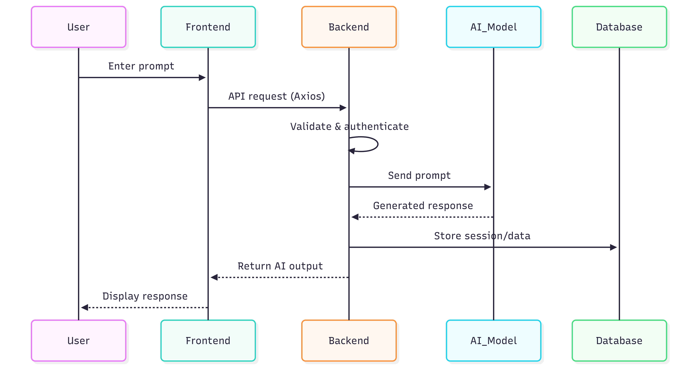
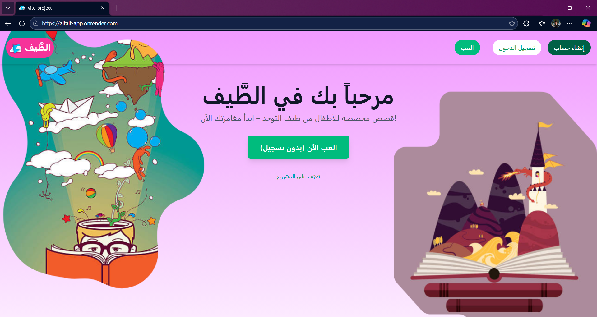
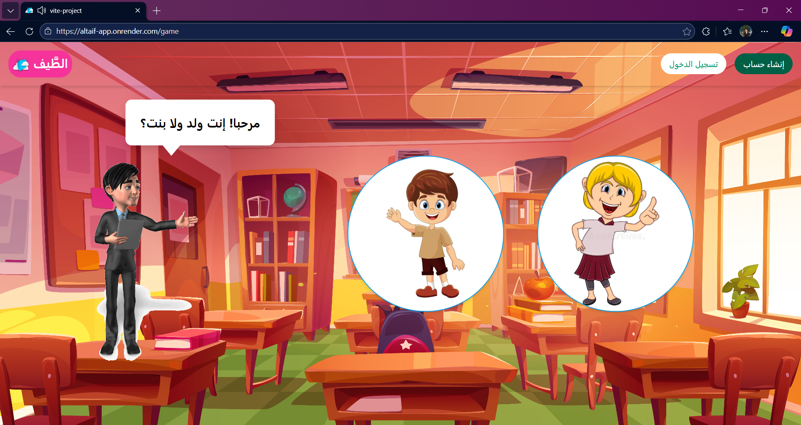
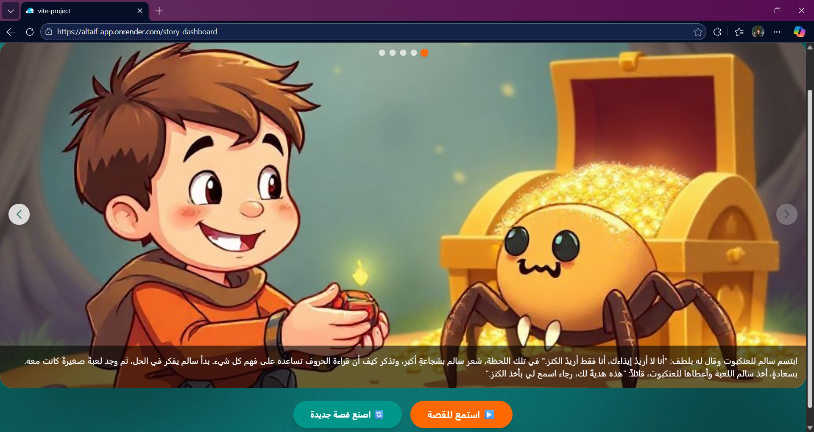

# Personalized Story Generation For Autistic Children Using Generative AI 

Altaif is a full-stack web application that generates personalized, interactive stories for children using AI.  
It combines a React-based client, a Node.js backend, and a locally hosted AI inference server built in Python.

The system is designed to adapt story content based on user choices and stored interaction data, with a focus on structured storytelling rather than free-form text generation.

---

## Table of Contents

- [Project Overview](#project-overview)
- [Architecture](#architecture)
- [Tech Stack](#tech-stack)
  - [Frontend](#frontend)
  - [Backend](#backend)
  - [AI Server](#ai-server)
- [Repository Structure](#repository-structure)
- [AI Server (Local Only)](#ai-server-local-only)
- [Running the Project](#running-the-project-development)
- [Features](#features)
- [Application Preview](#application-preview)

---

## Project Overview

The application consists of three main components:

1. **Client** – Interactive front-end for users (React + Vite)
2. **Server** – REST API, authentication, and game/story logic (Node.js + Express)
3. **AI Server** – Local Python service hosting a fine-tuned language model for story generation

> ⚠️ The AI server and model files are **not included in this repository** due to size constraints (~1.4 GB).

---

## Features

* User authentication (email + Google OAuth)
* Interactive story gameplay
* Choice-based story progression
* Story dashboard
* Media-rich UI (audio, images, video)

---

## Architecture



- The client never communicates directly with the AI server or the APIs.
- The backend acts as a controlled interface for story generation.
- Stories are generated via an API on the public website, while it's done with our AI server when run locally.

---

## Tech Stack

### Frontend
- React 19
- Vite
- React Router
- Tailwind CSS
- TanStack React Query
- Axios

### Backend
- Node.js
- Express
- MongoDB (Atlas)
- Mongoose
- JWT Authentication
- Google OAuth
- OpenAI SDK (story generation abstraction)
- Cloudinary (media handling)
- Nodemailer (email flows)

### AI Server
- Python
- Fine-tuned transformer-based language model
- Hugging Face model format (`safetensors`)
- Local inference only

---

## Repository Structure

```
└── 📁altaif-app
    └── 📁client
        └── 📁public
            └── 📁images
                └── 📁feedback
                └── 📁game
                └── 📁website
            └── 📁sounds
                └── 📁choices
                └── 📁questions
            └── 📁videos
                ├── generating-story-bg.mp4
            ├── StoryLogo.png
        └── 📁src
            └── 📁components
                ├── Library.jsx
                ├── Navbar.jsx
                ├── Overlay.jsx
                ├── SidePanel.jsx
                ├── SigninForm.jsx
                ├── SignupForm.jsx
            └── 📁context
                ├── AuthContext.jsx
            └── 📁pages
                ├── AboutPage.jsx
                ├── AuthModal.jsx
                ├── DashboardPage.jsx
                ├── ForgotPassword.jsx
                ├── Game.jsx
                ├── GamePage.jsx
                ├── Index.jsx
                ├── LibraryPage.jsx
                ├── ResetPassword.jsx
                ├── StoryDashboard.jsx
            └── 📁utils
                ├── api.js
                ├── gameData.js
                ├── imageMap.js
            ├── App.jsx
            ├── index.css
            ├── main.jsx
        ├── eslint.config.js
        ├── index.html
        ├── package-lock.json
        ├── package.json
        ├── vite.config.js
    └── 📁server
        └── 📁config
            ├── db.js
        └── 📁controllers
            ├── authController.js
            ├── gameController.js
            ├── storyController.js
        └── 📁middleware
            ├── authMiddleware.js
        └── 📁models
            ├── GameData.js
            ├── Story.js
            ├── User.js
        └── 📁routes
            ├── authRoutes.js
            ├── gameRoutes.js
            ├── storyRoutes.js
        └── 📁utils
            ├── generateToken.js
            ├── storyGen.js
        ├── server.js
    ├── .gitignore
    ├── package-lock.json
    └── package.json
```

---

## AI Server (Local Only)

The `ai_server` directory contains:
- Fine-tuned model weights
- Tokenizer configuration
- Evaluation results
- Python API (`app.py`) for inference

Because the model exceeds GitHub size limits, it is excluded from version control.

To run the full system, the AI server must be available locally and running before starting the backend.

---

## Running the Project (Development)

### 1. Start the AI Server (Local)
```bash
cd ai_server
python app.py
npm install # Also install the client dependencies (cd client; npm install)
npm run build
npm run dev
```

---

## Application Preview

### Landing Page


### Game


### Story Dashboard



